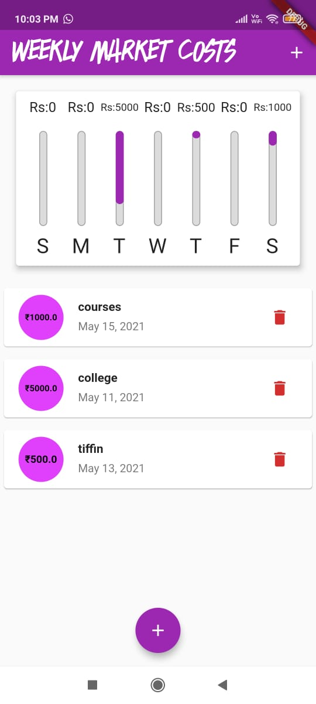

# PERSONAL EXPENCES-UI-FLUTTER-APPLICATION :star_struck: 
:family: :bow: :ok_woman: :dancer: :ok_hand: :relaxed:

[](https://shields.io/) [](https://shields.io/) [](https://shields.io/) [](https://shields.io/) [](https://shields.io/) [](https://shields.io/) [](https://shields.io/) [](https://shields.io/) [](https://shields.io/)


***This new Flutter application named 'PERSONAL EXPENCES-UI' is created by Biswarup Bhattacharjee, student of BTECH, in University of Engineering and Management, Kolkata.***

**Email Id: bbiswa471@gmail.com.** 

**Contact No: 916290272740.** 


<p align="left">
<a href="https://www.facebook.com/profile.php?id=100070395300810" target="blank"></a>
<a href="https://instagram.com/biswarup2210" target="blank"></a>
<a href="https://github.com/biswa2210/biswa2210" target="blank"></a>
</p>

## About :point_down: 

<div align="justified">
This is a Flutter Application for keeping personal expenses' record. The application is for both android and ios. The name of this app is Galaxy UI. This app is for watching records in charts not for keeping database. Here we can add expenses by adding title, amount, date. Here we can choose date from e virtual calendar. We can compare multiple records in a week in a form of a chart. We can use it for analysing and calculating one week's expenses. Watching the records in form of chart helps us understanding how much expences we had throughout the week. We can also delete records as per our need. We can balance our weekly cost with it. Many type of expenses we have like tuition, courses, ebill, movie tickets, rent, tiffin etc. We can add them in this app and calculate all amounts. It is a very useful and easy to use app for personal expences. This app' UI is very user friendly. Anyone can use it by just installing the application in mobile phone. This app is totally responsive users can use it in portrait or landscape mode as they want.
</div>

<details>
       <summary>"Details of Records"</summary>
 - Title<br>
 - Amount<br>
 - Date
</details>

## Info Table Example :thought_balloon: :point_down: 

|Title of Expenses|    Amount      |    Date        |
| -------------   | -------------  |  ------------  |
|    Tuition      |      2000      |  10/05/2021    |
|    Courses      |      3000      |  12/05/2021    |
|  Movie Tickets  |       600      |  14/05/2021    |
|    Tiffin       |      1000      |  15/05/2021    |

## APP DOWNLOAD LINK : :point_right: <a href="https://drive.google.com/file/d/15setveN3QAeq-ZW7EewySGuvuUaKe74F/view">Click here to download</a> 

## Purpose :point_down:

<div align="justified">
I have made this application so that people can install it in phone and use it for weekly expenses calculation. This app is user friendly so that anyone can use it. They can easily keep track of their expenses and balance their expenses as they want. The chart will help them to easily analyse the costs.       
</div>

## Use :point_down:

<div align="justified">
Users just have to install the application named 'Galaxy UI' in their android or iphone. Then they can open the app and add records as they want. They have to give title, amount and date for each espense. If they want to delete a record then they have to click on 'Delete' button.
</div>
       
## Importance :point_down:

<div align="justified">
In present poor, middle class, rich every type of people have to balance their monthly or weekly expenses. Systematic life gives us prosperity. So that this app is very important for everyone. Everyone has to keep track of their espenses so that this app helps them a lot in this.
</div>

## Folder Structure :point_down:
```bash
PersonalExpences-UI-Flutter
           ├── assets
           |     ├── fonts
           |     |     ├── AS.otf
           |     |     ├── BLACKAREA.ttf
           |     |     ├── Blazed.ttf
           |     |     ├── CB.ttf
           |     |     └── SummerFire.ttf
           |     └── images
           |           ├── sadface.png
           |           └── spsc.png
           └── lib
                 ├── models
                 |     └── transaction.dart
                 ├── widgets
                 |     ├── chart.dart
                 |     ├── chart_bars.dart
                 |     ├── new_transactions.dart
                 |     ├── transaction_list.dart
                 |     └── use_transactions.dart 
                 ├── home.dart
                 └── main.dart
```
     
## Making :point_down:

<div align="justified">
       
I have made this app using [FLUTTER](https://flutter.dev/?gclid=Cj0KCQjw38-DBhDpARIsADJ3kjliHdMH2hA97bBGqJtW5ORUUksCxpZ8cnrSWaH__HevGftAmP8AmvIaAhNlEALw_wcB&gclsrc=aw.ds) and [Dart](https://dart.dev/).
</div>

## Getting Started

This project is a starting point for a Flutter application.

A few resources to get you started if this is your first Flutter project:

- [Lab: Write your first Flutter app](https://flutter.dev/docs/get-started/codelab)
- [Cookbook: Useful Flutter samples](https://flutter.dev/docs/cookbook)

For help getting started with Flutter, view our
[online documentation](https://flutter.dev/docs), which offers tutorials,
samples, guidance on mobile development, and a full API reference.

## Screenshots :point_down: 

<div align="center">

<a href="pics/g1.jpeg"></a> <a href="pics/g2.jpeg"></a> <a href="pics/g3.jpeg"></a>

<a href="pics/g4.jpeg"></a> <a href="pics/g5.jpeg"></a> <a href="pics/g6.jpeg"></a>

<a href="pics/g7.jpeg"></a> <a href="pics/g8.jpeg"></a> <a href="pics/g9.jpeg"></a>

<a href="pics/g10.jpeg"></a> <a href="pics/g11.jpeg"></a> 

<a href="pics/g12.jpeg"></a> <a href="pics/g13.jpeg"></a> 

<a href="pics/g14.jpeg"></a> <a href="pics/g15.jpeg"></a> 

<a href="pics/g16.jpeg"></a> <a href="pics/g1.jpeg"></a> 

<a href="pics/g18.jpeg"></a> <a href="pics/g19.jpeg"></a> 
</div>


